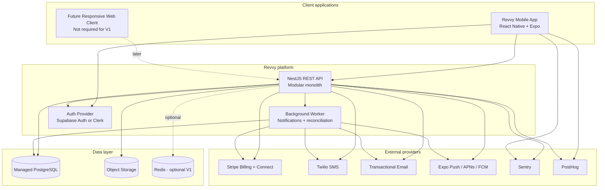
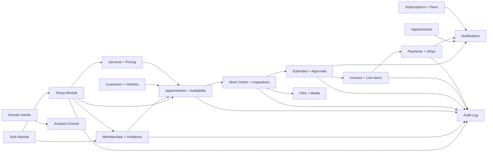
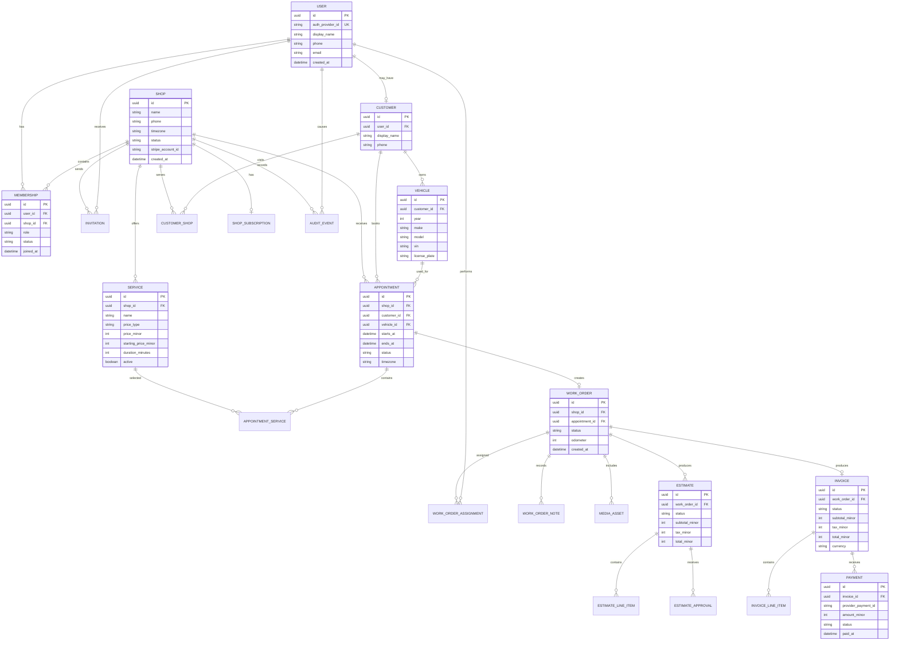
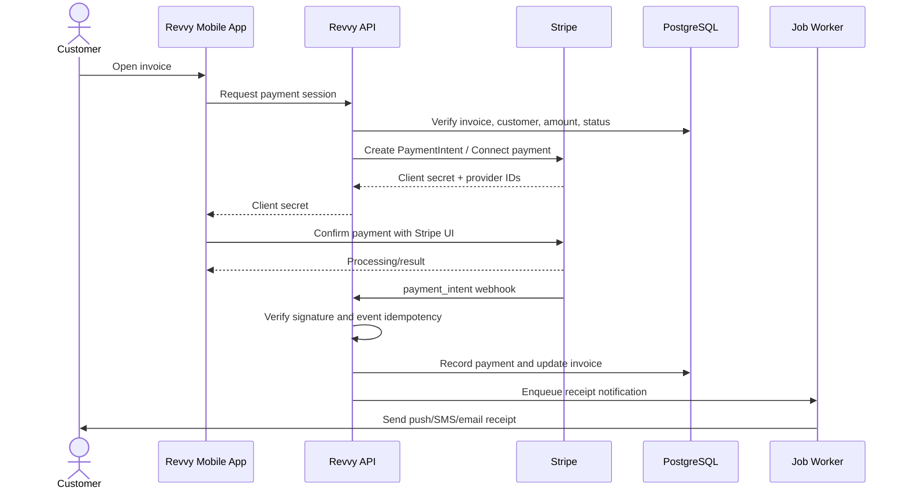
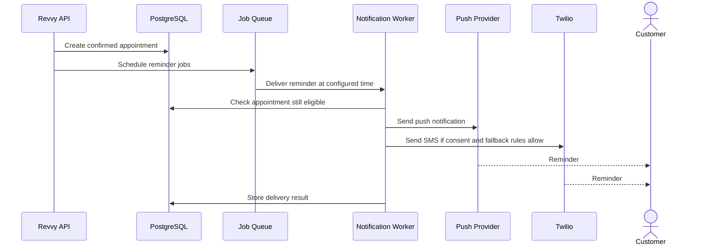
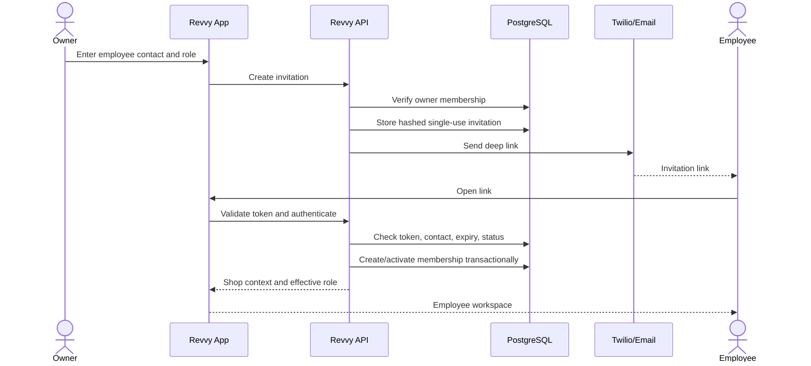
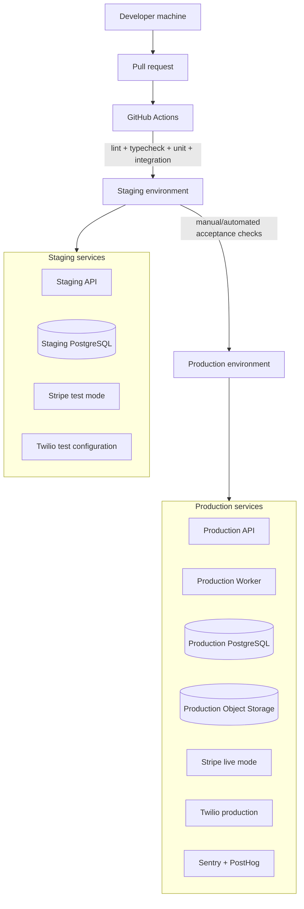
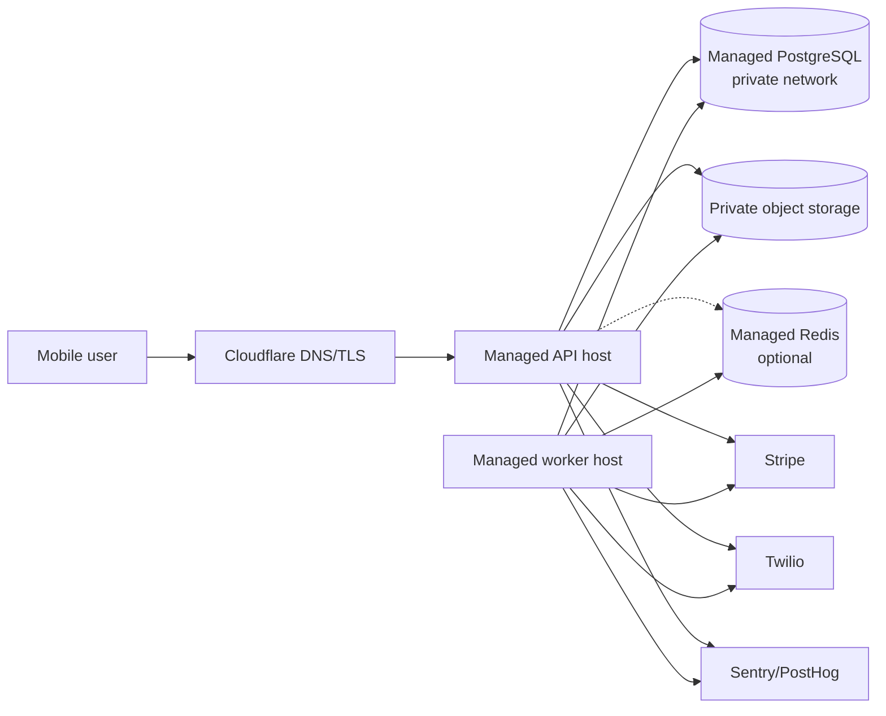
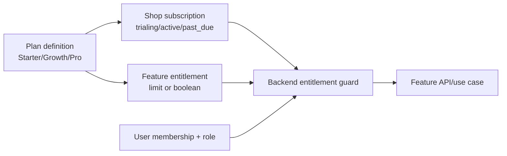
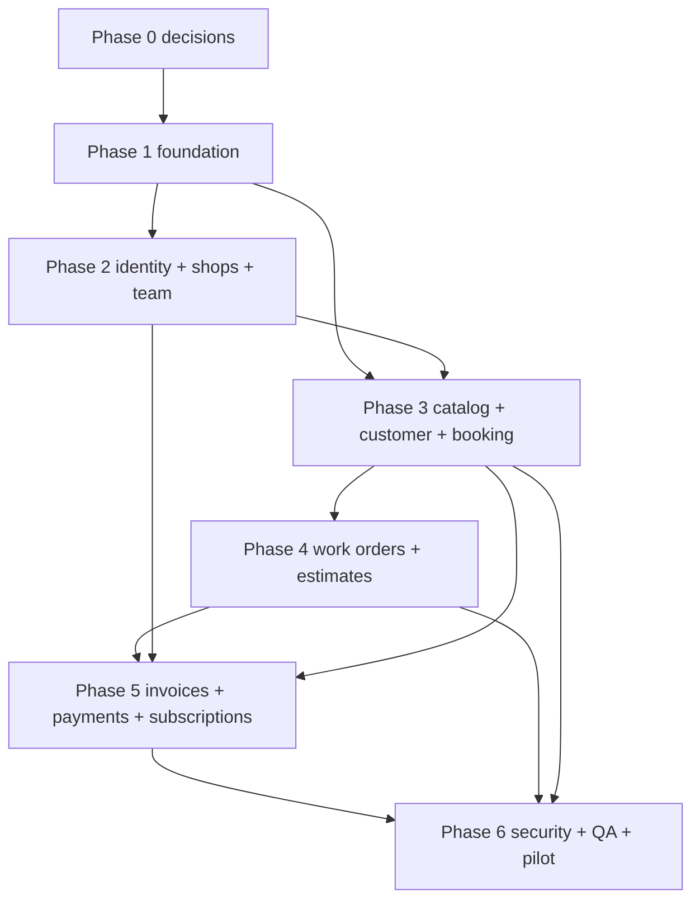

# Revvy V1 Product, Architecture, and Infrastructure Specification

**Document status:** Initial product and engineering specification  
**Product:** Revvy  
**Version:** V1 / MVP  
**Audience:** Product owner, designers, engineering subagents, QA, DevOps, security, and future contributors  
**Last updated:** 2026-07-12  
**Primary market:** Independent auto-service businesses in New York City, with a platform that can expand geographically  

---

## 1. Executive summary

Revvy is a mobile-first platform for independent auto-service businesses and their customers. It gives a shop one place to manage customers, vehicles, appointments, services, work orders, estimates, invoices, payments, and customer communication.

Revvy V1 is **one mobile application with role-based views**, not three separate applications:

- **Owner view:** configure and operate a shop.
- **Employee view:** execute assigned work and update job progress.
- **Customer view:** find or open a shop, book a service, approve work, pay, and view service history.

The product is mobile-first, but it is not mobile-only. The backend, API contracts, design tokens, and domain logic must support a responsive web client later without requiring a rewrite.

The V1 commercial model is subscription SaaS:

- Starter: **$25/month**
- Growth: **$50/month**
- Pro: **$100/month**
- Employees and customers use Revvy without paying a subscription.
- Payment processing and SMS costs must be transparent and must not create surprise charges.

The central customer promise is **trust through transparency**. Revvy should show an exact fixed price when a service can be priced exactly. When an inspection is required, Revvy should show the inspection fee, explain what is unknown, and require customer approval before additional work begins.

---

## 2. Product principles

These principles are mandatory design constraints for V1.

### 2.1 One product, role-based views

Do not build separate owner, employee, and customer mobile applications for V1. Build one app with a role-aware navigation shell and role-specific screens.

A user may have more than one role over time. Role and shop membership are separate concepts:

- A person is a `User`.
- A business is a `Shop`.
- The connection is a `Membership`.
- The membership has a role and status.

### 2.2 Mobile-first, API-first

All primary workflows must be usable on a phone. The API and domain model must not depend on a particular client. A future web dashboard should consume the same API and permissions model.

### 2.3 Owner-created shop, invitation-based employees

A shop is created by an owner. Employees do not create shops and do not select arbitrary shops during signup. The owner invites employees by phone or email; accepting the invitation creates or activates the membership.

### 2.4 Customer signup must be low friction

Customers need an account for saved vehicles, bookings, payments, and history, but V1 should use passwordless phone OTP or magic-link authentication. Do not require a password during initial signup.

### 2.5 Transparent price semantics

Every bookable service must explicitly declare one of:

- `FIXED_PRICE`: the customer sees a price before booking.
- `STARTING_AT`: the customer sees a minimum/starting price and a clear explanation.
- `INSPECTION_REQUIRED`: the customer sees an inspection fee and must approve any resulting estimate.

Never represent an uncertain repair as a misleading exact fixed price.

### 2.6 Modular monolith before microservices

V1 uses one backend deployment and one primary database. Code is organized into modules with explicit boundaries so modules can be extracted later if required. Do not introduce microservices, Kubernetes, or event infrastructure that the product does not yet need.

### 2.7 Secure by server-side authorization

The client may hide or show UI based on role, but the API is the source of truth. Every shop-scoped read and write must enforce membership, role, object ownership, and shop context on the server.

### 2.8 Build for small-business reality

Assume owners and employees may have limited technical experience, busy schedules, unreliable connectivity, and shared devices. Use clear language, sensible defaults, recoverable errors, and draft/offline-friendly flows where practical.

---

## 3. Goals and non-goals

### 3.1 V1 goals

1. Let an owner create a shop in under five minutes.
2. Let an owner define bookable services and prices.
3. Let an owner invite an employee without the employee searching for the shop.
4. Let a customer create an account with phone verification.
5. Let a customer select a shop and vehicle, then request/book an appointment.
6. Let the shop manage appointment status and assign work.
7. Let an employee update a work order with notes and photos.
8. Let a shop create an estimate for non-fixed work.
9. Let a customer approve or reject an estimate.
10. Let a shop issue an invoice and let a customer pay in the app.
11. Let all participants receive appointment, estimate, invoice, and status notifications.
12. Let the owner start, manage, and cancel a paid subscription.
13. Ensure every shop can only access its own business data.
14. Provide enough analytics to measure activation and workflow completion.

### 3.2 Explicit V1 non-goals

Do not build these in V1 unless a product decision explicitly changes this document:

- Separate native applications for each role.
- Full desktop dashboard.
- Public marketplace ranking, bidding, or lead auctions.
- AI diagnosis or AI-generated repair decisions.
- Parts supplier integrations or inventory management.
- Full accounting/bookkeeping software.
- Fleet management.
- Insurance claims processing.
- Real-time chat as a core feature.
- Complex calendar synchronization with every external provider.
- Custom payment processing or storage of card numbers.
- Arbitrary employee self-join without shop approval.
- Multi-location support in the base V1 workflow. Pro may reserve the capability, but implementation can be deferred.
- Guaranteed diagnosis or repair outcome.

---

## 4. Actors and permissions

### 4.1 Actors

| Actor | Description | Primary device usage |
| --- | --- | --- |
| Owner | Creates and pays for a shop subscription; controls shop settings and team | Mobile first; web later |
| Manager | Runs daily operations with delegated permissions | Mobile first; web later |
| Front desk | Manages customers, appointments, estimates, and invoices | Mobile first; web later |
| Mechanic/technician | Performs service work and records job progress | Mobile |
| Customer | Books service, approves work, pays, and views history | Mobile |
| Revvy administrator | Internal support and abuse/billing operations; not a shop user | Internal tools only |

### 4.2 Initial role model

V1 uses fixed roles with a permission matrix. Avoid a custom permission builder until the base workflows are validated.

| Capability | Owner | Manager | Front desk | Technician | Customer |
| --- | ---: | ---: | ---: | ---: | ---: |
| Manage shop profile | Yes | Yes | No | No | No |
| Manage services/prices | Yes | Yes | Optional | No | No |
| Manage team/invitations | Yes | Yes | No | No | No |
| View all appointments | Yes | Yes | Yes | Assigned only | Own only |
| Create/edit customers | Yes | Yes | Yes | Limited | Own profile |
| Create work orders | Yes | Yes | Yes | Yes | No |
| Update work status | Yes | Yes | Yes | Yes | No |
| Upload job photos/notes | Yes | Yes | Yes | Yes | No |
| Create estimates | Yes | Yes | Yes | Draft/request only | No |
| Approve estimates | No | No | No | No | Own only |
| Issue invoices | Yes | Yes | Yes | No | No |
| Pay invoices | No | No | No | No | Own only |
| View shop financial analytics | Yes | Configurable | No | No | No |
| Manage subscription | Yes | No | No | No | No |
| Delete/deactivate shop | Yes, protected | No | No | No | No |

### 4.3 Authorization rules

- Every business-owned resource has a `shopId`.
- Every request has a resolved authenticated `userId` and active `shopId` where applicable.
- The backend derives effective role from an active `Membership`; the client cannot submit its own role as authority.
- A suspended, revoked, or expired membership cannot access shop data.
- A customer can only access their own customer profile, vehicles, appointments, estimates, invoices, payments, and shared documents.
- Technicians may see only assigned work orders unless the owner explicitly grants broader access.
- Historical records must not be deleted when a user leaves. Membership is deactivated and records remain auditable.

---

## 5. Product information architecture

The app has a shared account layer and role-specific workspaces.

### 5.1 Shared navigation

- Home
- Appointments / Jobs
- Messages or Notifications
- Profile
- Shop switcher, only when a user belongs to more than one shop

### 5.2 Owner/manager navigation

- Overview
- Calendar
- Customers
- Vehicles
- Services
- Work orders
- Estimates
- Invoices/payments
- Team
- Shop settings
- Subscription

### 5.3 Technician navigation

- My jobs
- Job detail
- Inspection checklist
- Photos and notes
- Parts/material notes, if enabled later
- Profile

### 5.4 Customer navigation

- Home / Find a service
- My appointments
- My vehicles
- Estimates to approve
- Invoices and receipts
- Service history
- Profile and payment methods

### 5.5 Shop context

When a user has shop access, the app must display the active shop name and a visual context indicator. Do not allow a user to perform a mutation against a shop that is not the active authorized context.

A customer may have relationships with multiple shops. A customer does not become globally owned by one shop.

---

## 6. Core user flows

### 6.1 Owner signup and shop creation

#### Happy path

1. User opens Revvy and selects `Create a shop`.
2. User authenticates with phone OTP, email magic link, or supported identity provider.
3. User enters name and preferred contact details.
4. User enters shop name, address, phone number, timezone, and business hours.
5. User accepts terms and confirms they are authorized to create the shop.
6. API creates the `User`, `Shop`, and owner `Membership` in one transaction.
7. API creates a default subscription state of `TRIALING`.
8. App opens the owner onboarding checklist.
9. Owner adds at least one service before publishing booking availability.
10. Owner may invite employees or skip and return later.

#### Acceptance criteria

- An owner can reach the shop home screen after successful shop creation.
- A failed step can be retried without creating duplicate shops.
- The shop timezone is stored explicitly; never infer it on every request.
- The owner cannot access another shop’s records by changing an identifier in a request.
- Onboarding progress is resumable.

### 6.2 Employee invitation and activation

1. Owner opens `Team`.
2. Owner enters employee name, phone or email, and role.
3. API validates the owner’s permission and creates a single-use invitation.
4. Revvy sends an SMS or email containing a deep link.
5. Employee opens the link and authenticates or creates an account.
6. API verifies the invitation token, checks expiry and intended contact, and creates/activates the membership.
7. Employee sees the shop name and assigned role before acceptance.
8. App opens the employee workspace.

#### Rules

- Invitation token is random, single-use, hashed at rest, and expires.
- Resending invalidates the previous active token.
- Employee cannot alter the role during acceptance.
- Employee cannot create a new shop as part of accepting an invitation.
- Owner can revoke a pending invitation.
- Owner can deactivate a membership without deleting historical work.

### 6.3 Customer signup and shop selection

Customers need an account, but signup must be lightweight.

#### Entry points

1. Customer scans a shop QR code or opens a shop deep link.
2. Customer receives a booking link by text.
3. Customer searches by shop name, neighborhood, or ZIP code if public discovery is enabled.

#### Flow

1. Customer opens Revvy.
2. Customer authenticates with phone OTP.
3. Customer enters name.
4. Customer adds or selects a vehicle.
5. Customer selects a shop or confirms the linked shop.
6. Customer views the shop’s services and pricing semantics.
7. Customer books a service or requests an inspection.

#### V1 discovery constraint

Public discovery should be basic: name, address, hours, services, and availability. Do not implement ranking, reviews-based ordering, paid placement, or marketplace bidding in V1.

### 6.4 Service catalog and transparent pricing

A shop owner can create a service with:

- Name
- Description
- Category
- Duration estimate
- Price type
- Price in minor currency units
- Optional starting price
- Optional vehicle applicability fields
- Tax behavior
- Active/inactive state
- Booking availability

Example service records:

```text
Synthetic oil change
Price type: FIXED_PRICE
Price: $79.99

Brake inspection
Price type: INSPECTION_REQUIRED
Inspection fee: $49.00
Estimate required: true

Brake repair
Price type: STARTING_AT
Starting price: $249.00
Explanation: Final price depends on vehicle and inspection findings.
```

#### Pricing rules

- Store monetary values as integer minor units, e.g. `7999`, never floating-point dollars.
- Store the currency code, initially `USD`.
- Snapshot service price and description into appointment/work-order line items so future catalog edits do not rewrite history.
- Include taxes and fees explicitly in the customer-facing breakdown.
- A customer must approve any estimate line items not included in the originally booked service.

### 6.5 Appointment booking

1. Customer chooses a shop.
2. Customer selects a vehicle.
3. Customer selects a service.
4. App requests available time slots from the API.
5. Customer selects a slot.
6. API rechecks availability inside a transaction.
7. API creates the appointment with status `REQUESTED` or `CONFIRMED`, depending on shop settings.
8. Customer receives an in-app notification and optional SMS/email.
9. Shop receives a new appointment notification.

#### Concurrency requirement

Availability must be validated server-side. Two customers must not be able to reserve the same exclusive slot because they submitted requests at the same time.

V1 can use a simple slot model:

- Shop business hours
- Service duration
- Configured bay/staff capacity
- Existing active appointments
- Blocked time ranges

Do not build sophisticated optimization in V1.

### 6.6 Work order execution

A work order is created from an appointment or manually by staff.

Suggested status lifecycle:

```text
DRAFT
  → SCHEDULED
  → CHECKED_IN
  → IN_PROGRESS
  → WAITING_FOR_APPROVAL
  → APPROVED
  → WORK_COMPLETED
  → READY_FOR_PICKUP
  → COMPLETED
  → CANCELLED
```

Not every job uses every state. Status transitions must be validated by the API.

Technician capabilities:

- See assigned work orders.
- Start or pause work.
- Add inspection notes.
- Add photos.
- Add recommended services.
- Request an estimate or approval.
- Mark work complete.

Every status change records actor, timestamp, previous status, new status, and optional note.

### 6.7 Estimate approval

1. Staff creates an estimate from inspection findings.
2. Estimate contains immutable line-item snapshots, tax, discount, and total.
3. API marks estimate `SENT` and creates a customer notification.
4. Customer opens a secure authenticated estimate screen.
5. Customer can approve or reject the complete estimate in V1.
6. API records decision, actor, timestamp, and optional note.
7. Approved work may be added to the work order.
8. Rejected work remains in history but cannot be silently performed.

V1 should not support partial line-item approval unless product scope expands. Whole-estimate approval keeps the state model simpler.

### 6.8 Invoice and customer payment

1. Staff creates an invoice from completed work-order items.
2. API snapshots line items and computes totals.
3. Customer receives an invoice notification.
4. Customer opens the invoice and selects `Pay`.
5. App uses Stripe’s mobile payment UI; raw card data never touches Revvy servers.
6. Stripe sends a webhook to Revvy.
7. Revvy verifies the webhook signature and idempotently records payment status.
8. Customer receives a receipt.
9. Shop sees the invoice as paid.

Payment UI must not mark an invoice paid based only on client success. The verified webhook or authoritative Stripe API response is required.

### 6.9 Subscription billing

1. Owner selects a plan.
2. Revvy creates or updates a Stripe Billing customer/subscription.
3. Stripe handles payment method collection and recurring billing.
4. Stripe webhook updates Revvy’s subscription state.
5. App displays current plan, next billing date, and any payment issue.
6. Grace period rules determine what shop functionality remains available after a failed payment.

Recommended grace behavior:

- Keep read access and existing customer communication available during a short grace period.
- Prevent new shop configuration changes only after the grace period.
- Never delete shop data because of a billing failure.

---

## 7. V1 functional requirements

### 7.1 Authentication and identity

- Phone OTP authentication is required for customers and supported for employees/owners.
- Email magic link or password authentication may be offered as an alternative.
- Authentication provider owns credential security; Revvy never stores raw passwords if an external provider is used.
- User profile includes display name, phone, email, avatar, and notification preferences.
- Sessions are revocable.
- Account deletion requests must be handled according to legal and retention requirements.

### 7.2 Shop management

- Create, update, publish, suspend, and archive a shop.
- Store address, timezone, phone, hours, holiday closures, logo, and description.
- Shop has a public booking status: `DRAFT`, `PUBLISHED`, `PAUSED`, or `ARCHIVED`.
- A shop cannot accept public bookings until required setup is complete.

### 7.3 Team management

- Invite by phone/email.
- List pending invitations and active memberships.
- Resend or revoke invitations.
- Change a member’s role with audit record.
- Deactivate/reactivate a membership.
- Show last active time only if privacy policy permits.

### 7.4 Customers and vehicles

- Staff can create a customer record from an appointment or manually.
- Customer can manage their own profile.
- Customer can add multiple vehicles.
- Vehicle fields: year, make, model, trim/engine optional, VIN optional, license plate optional, nickname, mileage optional.
- VIN and license plate are sensitive business data; restrict visibility and avoid unnecessary collection.
- Staff can view customer history only within their shop context.

### 7.5 Appointments

- Create, list, update, cancel, confirm, reschedule, check in, and complete.
- Filter by date, status, service, employee, and vehicle.
- Appointment has an audit timeline.
- Cancellation reason is captured.
- Customer receives a clear cancellation/reschedule outcome.

### 7.6 Work orders

- Create from appointment.
- Assign one or more employees, with one primary assignee in V1.
- Add notes and photos.
- Track status transitions.
- Link recommended services and estimates.
- Link final invoice.

### 7.7 Notifications

Channels:

- In-app notifications: required.
- Push notifications: required for mobile where permission is granted.
- SMS: transactional messages, opt-in and opt-out compliant.
- Email: optional fallback for receipts and account events.

Notification types:

- Invitation created.
- Appointment requested/confirmed/rescheduled/cancelled.
- Appointment reminder.
- Vehicle checked in.
- Estimate sent/approved/rejected.
- Vehicle ready.
- Invoice issued/paid.
- Subscription payment failed.

Every notification needs an idempotency key and delivery status.

### 7.8 Billing and payments

- Shop subscriptions: Stripe Billing.
- Customer invoice payments: Stripe PaymentSheet and Stripe Connect where funds are paid to shops through the platform.
- Refunds and disputes must be represented in the data model.
- Revvy must never store PAN/card numbers or CVV.
- Payment provider IDs are stored for reconciliation.
- Billing webhook processing is idempotent and auditable.

**Business/legal dependency:** Before real-money launch, confirm Stripe Connect account type, platform fee handling, merchant-of-record responsibilities, sales tax treatment, refund policy, dispute ownership, and New York requirements with qualified legal/accounting professionals.

---

## 8. Recommended technology stack

### 8.1 Mobile client

- **React Native** with **Expo**
- **TypeScript** with strict mode
- **Expo Router** for file-based navigation
- **TanStack Query** for server state, caching, retries, and invalidation
- **Zustand** only for small client/UI state, not as a replacement for server state
- **React Hook Form** for forms
- **Zod** for client validation and shared request schemas where practical
- **NativeWind** or a small internal design system for styling
- **Expo Notifications** for push notifications
- **Expo Image Picker/Camera** for inspection photos
- **Sentry** for crash/error reporting
- **EAS Build and EAS Submit** for mobile builds and store submission

Do not duplicate domain rules between screens. The API remains authoritative.

### 8.2 Backend

- **NestJS** modular monolith
- **TypeScript** strict mode
- REST API under `/api/v1`
- OpenAPI/Swagger generated from the backend
- **Prisma** ORM
- PostgreSQL
- Redis only for queue/cache/rate-limit needs that justify it
- BullMQ for asynchronous jobs if background work exceeds request latency
- Pino-compatible structured logging
- Zod or class-validator, but use one consistent validation approach

### 8.3 Infrastructure services

| Concern | V1 recommendation | Purpose |
| --- | --- | --- |
| Mobile build/distribution | Expo EAS | iOS/Android builds and submission |
| API hosting | Railway, Render, Fly.io, or equivalent managed container host | Run NestJS API and worker |
| Database | Managed PostgreSQL | Durable relational data |
| Authentication | Supabase Auth or Clerk; choose one before implementation | OTP, sessions, identity |
| Object storage | Supabase Storage, S3, or Cloudflare R2 | Inspection photos and documents |
| Subscription billing | Stripe Billing | Shop SaaS subscriptions |
| Customer payments | Stripe PaymentSheet + Connect | Invoice payments to shops |
| SMS | Twilio | OTP fallback, invitations, reminders, transactional messages |
| Email | Resend or Postmark | Receipts and transactional fallback |
| Push | Expo Notifications/APNs/FCM | Mobile notifications |
| Error monitoring | Sentry | Crash and exception visibility |
| Product analytics | PostHog | Activation and workflow analytics |
| DNS/domain | Cloudflare | DNS, TLS, optional edge controls |
| CI/CD | GitHub Actions | Test, lint, build, deploy |
| Secrets | Host secret manager plus local `.env.example` | Environment configuration |

### 8.4 Authentication decision

For the smallest implementation surface, choose one provider before coding:

#### Option A: Supabase Auth

- Strong fit if using Supabase Postgres and Storage.
- Phone OTP and email auth are available.
- Backend validates Supabase JWTs.
- Keep shop authorization in Revvy’s own `Membership` table.

#### Option B: Clerk

- Strong fit if organization invitations and polished auth UI are the priority.
- Backend validates Clerk JWTs.
- Keep business domain data and effective authorization in Revvy’s database.

This specification does not permit mixing both providers in V1. The implementation lead must make one decision in the architecture decision record before scaffolding.

---

## 9. System architecture

### 9.1 Logical architecture



### 9.2 Backend module boundaries



### 9.3 Recommended repository layout

Use a monorepo even though V1 has one mobile client and one API. Shared schemas and configuration are valuable.

```text
revvy/
├── apps/
│   ├── mobile/                    # Expo React Native application
│   └── api/                       # NestJS API and worker entrypoints
├── packages/
│   ├── contracts/                 # API DTOs and shared schemas
│   ├── config/                    # TypeScript, ESLint, Prettier config
│   ├── design-tokens/             # Colors, spacing, typography, motion
│   └── test-utils/                # Fixtures and test helpers
├── prisma/
│   ├── schema.prisma
│   ├── migrations/
│   └── seed.ts
├── docs/
│   ├── architecture/
│   ├── api/
│   ├── decisions/
│   └── runbooks/
├── .github/workflows/
├── package.json
├── turbo.json                    # If Turborepo is selected
├── pnpm-workspace.yaml
├── .env.example
└── README.md
```

Use pnpm and Turborepo only if the team is comfortable with them. A workspace without Turborepo is acceptable; do not let tooling delay the product.

---

## 10. Data model

### 10.1 Entity relationship graph



### 10.2 Required persistence rules

- Use UUIDs or another non-sequential public identifier.
- Use UTC timestamps in the database; retain shop timezone for display and scheduling interpretation.
- Use soft deletion or archival for business records where history matters.
- Use unique constraints for shop membership, active invitation token, external payment IDs, and idempotency keys.
- Add `createdAt`, `updatedAt`, and where relevant `createdBy`/`updatedBy`.
- Add `shopId` to every shop-owned table, even where it could be derived through a relation. This makes authorization queries explicit and safer.
- Use database transactions for onboarding, invitation acceptance, appointment creation, estimate approval, invoice creation, and webhook state changes.
- Store immutable snapshots for service/pricing/invoice/estimate line items.

### 10.3 Suggested status enums

```text
MembershipStatus: INVITED, ACTIVE, SUSPENDED, DEACTIVATED
InvitationStatus: PENDING, ACCEPTED, REVOKED, EXPIRED
ShopStatus: DRAFT, PUBLISHED, PAUSED, ARCHIVED
AppointmentStatus: REQUESTED, CONFIRMED, RESCHEDULED, CHECKED_IN, IN_PROGRESS, COMPLETED, CANCELLED, NO_SHOW
WorkOrderStatus: DRAFT, SCHEDULED, CHECKED_IN, IN_PROGRESS, WAITING_FOR_APPROVAL, APPROVED, WORK_COMPLETED, READY_FOR_PICKUP, COMPLETED, CANCELLED
EstimateStatus: DRAFT, SENT, APPROVED, REJECTED, EXPIRED, CANCELLED
InvoiceStatus: DRAFT, OPEN, PARTIALLY_PAID, PAID, VOID, UNCOLLECTIBLE
PaymentStatus: CREATED, REQUIRES_ACTION, PROCESSING, SUCCEEDED, FAILED, REFUNDED, DISPUTED
SubscriptionStatus: TRIALING, ACTIVE, PAST_DUE, PAUSED, CANCELLED, INCOMPLETE
```

---

## 11. API specification

### 11.1 API conventions

- Base path: `/api/v1`
- JSON request/response bodies.
- ISO 8601 timestamps with timezone offset at API boundaries.
- Cursor pagination for potentially large collections.
- Standard error envelope:

```json
{
  "error": {
    "code": "APPOINTMENT_SLOT_UNAVAILABLE",
    "message": "The selected time is no longer available.",
    "requestId": "req_01...",
    "fieldErrors": []
  }
}
```

- Use `Idempotency-Key` for appointment creation, payment-related commands, invitation send, and webhook-derived commands.
- Require `If-Match` or version checks for high-conflict mutations where appropriate.
- Never accept `shopId` from the client as the only authorization signal. Resolve shop context from authenticated membership and validate any requested shop explicitly.

### 11.2 Endpoint groups

#### Auth and profile

```text
GET    /api/v1/me
PATCH  /api/v1/me
GET    /api/v1/me/shops
POST   /api/v1/me/device-tokens
DELETE /api/v1/me/device-tokens/:id
```

Authentication endpoints are provided by the selected auth provider; Revvy API validates the provider token.

#### Shops

```text
POST   /api/v1/shops
GET    /api/v1/shops/:shopId
PATCH  /api/v1/shops/:shopId
POST   /api/v1/shops/:shopId/publish
POST   /api/v1/shops/:shopId/pause
GET    /api/v1/shops/:shopId/hours
PATCH  /api/v1/shops/:shopId/hours
```

#### Memberships and invitations

```text
GET    /api/v1/shops/:shopId/members
POST   /api/v1/shops/:shopId/invitations
GET    /api/v1/shops/:shopId/invitations
POST   /api/v1/shops/:shopId/invitations/:id/resend
POST   /api/v1/shops/:shopId/invitations/:id/revoke
POST   /api/v1/invitations/:token/accept
PATCH  /api/v1/shops/:shopId/members/:memberId
POST   /api/v1/shops/:shopId/members/:memberId/deactivate
```

#### Services and pricing

```text
GET    /api/v1/shops/:shopId/services
POST   /api/v1/shops/:shopId/services
GET    /api/v1/shops/:shopId/services/:serviceId
PATCH  /api/v1/shops/:shopId/services/:serviceId
POST   /api/v1/shops/:shopId/services/:serviceId/archive
GET    /api/v1/public/shops/:shopId/services
```

#### Customers and vehicles

```text
GET    /api/v1/shops/:shopId/customers
POST   /api/v1/shops/:shopId/customers
GET    /api/v1/shops/:shopId/customers/:customerId
GET    /api/v1/me/vehicles
POST   /api/v1/me/vehicles
PATCH  /api/v1/me/vehicles/:vehicleId
DELETE /api/v1/me/vehicles/:vehicleId
GET    /api/v1/shops/:shopId/customers/:customerId/vehicles
```

#### Appointments and availability

```text
GET    /api/v1/public/shops/:shopId/availability
POST   /api/v1/shops/:shopId/appointments
GET    /api/v1/shops/:shopId/appointments
GET    /api/v1/appointments/:appointmentId
PATCH  /api/v1/appointments/:appointmentId
POST   /api/v1/appointments/:appointmentId/confirm
POST   /api/v1/appointments/:appointmentId/cancel
POST   /api/v1/appointments/:appointmentId/reschedule
POST   /api/v1/appointments/:appointmentId/check-in
```

#### Work orders, estimates, and invoices

```text
POST   /api/v1/shops/:shopId/work-orders
GET    /api/v1/shops/:shopId/work-orders
GET    /api/v1/work-orders/:workOrderId
PATCH  /api/v1/work-orders/:workOrderId/status
POST   /api/v1/work-orders/:workOrderId/assign
POST   /api/v1/work-orders/:workOrderId/notes
POST   /api/v1/work-orders/:workOrderId/media

POST   /api/v1/work-orders/:workOrderId/estimates
GET    /api/v1/estimates/:estimateId
POST   /api/v1/estimates/:estimateId/send
POST   /api/v1/estimates/:estimateId/approve
POST   /api/v1/estimates/:estimateId/reject

POST   /api/v1/work-orders/:workOrderId/invoices
GET    /api/v1/invoices/:invoiceId
POST   /api/v1/invoices/:invoiceId/send
POST   /api/v1/invoices/:invoiceId/payment-session
```

#### Payments, subscriptions, and webhooks

```text
GET    /api/v1/shops/:shopId/subscription
POST   /api/v1/shops/:shopId/subscription/checkout
POST   /api/v1/shops/:shopId/subscription/change-plan
POST   /api/v1/shops/:shopId/subscription/cancel
POST   /api/v1/shops/:shopId/stripe-connect/onboarding

POST   /api/v1/webhooks/stripe
POST   /api/v1/webhooks/twilio
```

Webhook routes must be unauthenticated at the application-user layer but protected by provider signature verification, replay protection, event persistence, and idempotent processing.

### 11.3 API authorization example

For `GET /api/v1/shops/:shopId/work-orders`:

1. Validate access token.
2. Resolve user identity.
3. Load active membership for `userId + shopId`.
4. Check role permission for listing work orders.
5. Apply role-specific filter, such as technician assignment.
6. Query by `shopId` and approved filters.
7. Return paginated results.
8. Record security/audit event only if the action is sensitive or configured for audit.

---

## 12. External integrations and event flows

### 12.1 Stripe customer invoice payment



### 12.2 Appointment reminder flow



### 12.3 Employee invitation flow



### 12.4 Integration rules

- Provider IDs are not sufficient as authorization IDs; map them to internal records.
- All provider webhooks are persisted before or while processing so failures can be retried.
- Webhook event IDs have a unique constraint.
- External calls have timeouts and bounded retries.
- Do not retry non-idempotent provider operations without an idempotency key.
- Provider outage must produce a recoverable UI state, not data corruption.

---

## 13. Infrastructure and environments

### 13.1 Environment topology



### 13.2 Minimum environments

- **Local:** local API, local/test database, mock or sandbox providers.
- **CI:** ephemeral or isolated test database; no production credentials.
- **Staging:** production-like configuration with Stripe test mode and non-production data.
- **Production:** live credentials, managed database, backups, monitoring, and controlled deploys.

### 13.3 Production deployment

Recommended initial deployment:

- Mobile builds through Expo EAS.
- NestJS API as a managed container/service.
- Background worker as a separate process from the same image, or a managed job worker.
- Managed PostgreSQL with automated backups and point-in-time recovery.
- Object storage with private buckets and signed URLs.
- Redis only when queues, rate limits, or caching require it.
- HTTPS everywhere.
- Database migrations run as a controlled release step, never automatically from every application instance.

### 13.4 Infrastructure graph



### 13.5 Required environment variables

Names are illustrative and must be documented in `.env.example`. Never commit real values.

```text
NODE_ENV
API_BASE_URL
DATABASE_URL
DIRECT_DATABASE_URL                 # if required by migration tooling
AUTH_PROVIDER_URL
AUTH_PROVIDER_PUBLIC_KEY
AUTH_PROVIDER_SECRET_KEY            # server only
STRIPE_SECRET_KEY
STRIPE_WEBHOOK_SECRET
STRIPE_PUBLISHABLE_KEY
STRIPE_CONNECT_CLIENT_ID            # if applicable
TWILIO_ACCOUNT_SID
TWILIO_AUTH_TOKEN
TWILIO_FROM_NUMBER
EMAIL_PROVIDER_API_KEY
OBJECT_STORAGE_ENDPOINT
OBJECT_STORAGE_BUCKET
OBJECT_STORAGE_ACCESS_KEY
OBJECT_STORAGE_SECRET_KEY
REDIS_URL                            # optional
SENTRY_DSN
POSTHOG_API_KEY
EXPO_PUBLIC_API_URL
EXPO_PUBLIC_AUTH_PROVIDER_KEY
EXPO_PUBLIC_STRIPE_PUBLISHABLE_KEY
```

The repository should contain `.env.example`, not `.env`. Local secrets belong in an ignored `.env` or platform secret store.

### 13.6 Backups and recovery

- Automated daily backups at minimum; use point-in-time recovery if the managed provider supports it.
- Test restoration before production launch and at least quarterly thereafter.
- Document recovery owner, credentials, steps, and expected recovery time objective.
- Store uploaded media separately from database backups with lifecycle rules.
- Never treat a replica as a backup.

---

## 14. Security, privacy, and compliance baseline

V1 handles identity, location, vehicle information, invoices, payment metadata, and potentially VIN/license plate data. Security is part of the product, not a post-launch add-on.

### 14.1 Required controls

- Verify JWT issuer, audience, signature, expiry, and subject.
- Validate all request bodies, query parameters, path parameters, and uploaded files.
- Enforce shop scope in every database query.
- Use parameterized queries/ORM safely; never concatenate SQL.
- Rate-limit OTP attempts, login-related requests, invitations, public booking, and webhooks.
- Store invitation and reset tokens hashed, not as plaintext.
- Use short-lived signed URLs for private media.
- Restrict upload MIME types, size, dimensions, and image processing paths.
- Scan or safely transform uploaded images where feasible.
- Redact tokens, payment secrets, and personal data from logs.
- Use least-privilege production credentials.
- Separate staging and production provider accounts/keys.
- Add audit events for role changes, invitation events, estimates, payments, refunds, and sensitive profile changes.
- Support account/session revocation.
- Use dependency scanning and secret scanning in CI.

### 14.2 Privacy requirements

- Collect only information needed for the workflow.
- Explain why phone, vehicle, VIN, and location data are collected.
- Provide notification preferences and SMS opt-out behavior.
- Do not use customer data for marketing without consent.
- Define retention and deletion behavior for inactive accounts and business records.
- Do not sell customer data.
- Provide a privacy policy and terms before public launch.

### 14.3 Payment boundary

Revvy must not store card numbers, security codes, or magnetic stripe data. Use Stripe-hosted/mobile components and store only provider IDs, statuses, amounts, currency, and reconciliation metadata.

### 14.4 Threat model priorities

1. Cross-shop data leakage.
2. Unauthorized employee access after deactivation.
3. Forged or replayed invitations.
4. Forged payment success from a modified client.
5. Webhook replay or duplicate processing.
6. Exposure of private inspection images.
7. OTP abuse and SMS cost abuse.
8. Shop-owner account takeover.
9. Malicious file uploads.
10. Insecure public booking endpoints.

---

## 15. Observability and operations

### 15.1 Logs

Structured logs must include:

- Timestamp
- Environment
- Service/module
- Severity
- Request ID
- User ID when safe
- Shop ID when safe
- Operation name
- Outcome and latency
- External provider request/event ID where relevant

Never log full OTPs, invitation tokens, authorization headers, card data, or unnecessary personal data.

### 15.2 Metrics

Track:

- API request count, latency, and error rate
- Database query latency and connection pool saturation
- Queue depth and job failure rate
- Notification delivery success/failure
- Appointment booking conflict rate
- Estimate approval rate
- Invoice payment success rate
- Stripe webhook lag
- SMS usage and failure rate
- Crash-free sessions
- Active shops and active customers

### 15.3 Alerts

Initial alerts:

- API 5xx rate above threshold.
- Database unavailable or storage nearly full.
- Webhook failures or processing lag.
- Queue backlog exceeds threshold.
- Payment failure rate anomaly.
- SMS spend/rate anomaly.
- Authentication/OTP abuse anomaly.
- Crash-free session rate degradation.

### 15.4 Operational runbooks

Create runbooks for:

- Failed deployment rollback.
- Database restore.
- Stripe webhook replay.
- Twilio outage.
- Provider credential rotation.
- Compromised account.
- Suspected cross-tenant data exposure.
- Customer refund/dispute.
- Subscription payment failure.

---

## 16. Testing strategy

### 16.1 Test layers

| Layer | Scope | Required examples |
| --- | --- | --- |
| Unit | Pure domain functions | Price calculation, status transitions, permission checks |
| Component | Mobile screens/components | Booking form, estimate approval, role navigation |
| API integration | Module + database | Tenant filtering, invitation acceptance, booking transaction |
| Contract | API schemas | Mobile client payloads and error envelopes |
| End-to-end | Critical workflows | Owner setup, employee join, customer booking, payment webhook |
| Security | Abuse and authorization | Cross-shop access, expired token, role escalation |
| Smoke | Staging health | Auth, shop load, service list, appointment read |

### 16.2 Mandatory acceptance tests

1. Owner creates a shop and cannot create duplicate shop records when the request is retried.
2. Employee invitation can be accepted once and only once.
3. Employee invitation for Shop A cannot activate membership in Shop B.
4. Deactivated employee receives authorization failure for new shop requests.
5. Customer can have vehicles and appointments at multiple shops without cross-shop leakage.
6. A customer sees exact fixed service pricing.
7. An inspection-required service never appears as an exact final price.
8. Concurrent appointment submissions cannot overbook the configured capacity.
9. Technician cannot view unrelated unassigned work orders when restricted.
10. Customer cannot approve an estimate belonging to another customer/shop.
11. Client-side “payment success” does not mark an invoice paid without authoritative provider confirmation.
12. Duplicate Stripe webhook delivery does not duplicate a payment or receipt.
13. Subscription downgrade does not delete data.
14. Private media is inaccessible without an authorized signed URL.
15. SMS opt-out prevents non-essential SMS delivery.

### 16.3 Definition of done

A feature is complete only when:

- Product acceptance criteria pass.
- API authorization tests exist.
- Loading, empty, offline/error, and retry states are designed.
- Analytics events are defined where relevant.
- Logs and errors are actionable.
- Database migration and rollback implications are documented.
- Accessibility labels and keyboard/screen-reader behavior are considered.
- No secrets are committed.
- CI passes lint, typecheck, tests, and build.
- Documentation is updated.

---

## 17. Analytics and success metrics

### 17.1 Activation definition

A shop is activated when all of the following occur:

1. Owner creates a shop.
2. At least one service is published.
3. At least one appointment is created.
4. At least one employee is invited or owner completes a solo workflow.
5. At least one customer interaction is completed.

### 17.2 Core events

Use stable event names and include non-sensitive context:

```text
owner_signup_completed
shop_created
shop_published
service_created
employee_invitation_sent
employee_invitation_accepted
customer_signup_completed
vehicle_added
appointment_requested
appointment_confirmed
appointment_cancelled
work_order_started
work_order_completed
estimate_sent
estimate_approved
invoice_sent
invoice_paid
subscription_started
subscription_payment_failed
```

Never include payment card details, OTPs, invitation tokens, or unnecessary personal data in analytics payloads.

### 17.3 Initial product metrics

- Owner signup-to-shop-created conversion.
- Shop-created-to-first-service conversion.
- Shop-created-to-first-appointment conversion.
- Employee invitation acceptance rate.
- Customer booking completion rate.
- Appointment no-show/cancellation rate.
- Estimate approval rate.
- Invoice payment success rate.
- Monthly active shops.
- Retention at 30 and 90 days.
- Subscription conversion after trial.
- Support tickets per active shop.

---

## 18. Pricing and business model

### 18.1 V1 plans

| Plan | Monthly price | Intended customer | Core limits/features |
| --- | ---: | --- | --- |
| Starter | $25 | Solo operator or very small shop | One shop, owner, up to 2 employees, services, appointments, basic records, limited notifications |
| Growth | $50 | Small independent shop | Starter plus up to 8 employees, estimates, online payments, photos, reminders, service history, basic reports |
| Pro | $100 | Busy shop or future multi-location operator | Growth plus advanced analytics, custom permissions, automation, review/loyalty tools, priority support |

Limits are configuration, not hard-coded business logic. Store plan entitlements centrally so plan packaging can change without rewriting feature modules.

### 18.2 Revenue sources

Primary:

- Recurring shop subscription.

Potential later revenue:

- Clearly disclosed platform fee on customer payments.
- SMS overage or communications add-on.
- Premium automation, marketing, reporting, inventory, accounting, or fleet modules.
- Additional locations.

Do not charge customers or employees for basic access in V1.

### 18.3 Entitlement model



Enforce entitlements on the backend. The mobile app may show upgrade prompts but cannot be the only enforcement layer.

### 18.4 Trial recommendation

Start with a 14-day trial, but validate this with customer interviews. Avoid requiring a credit card before a shop experiences the core workflow unless conversion data later supports it.

---

## 19. V1 delivery plan

The sequence below is designed for parallel subagents while preserving dependencies.

### Phase 0: decisions and discovery

#### Phase 0 outputs

- Final auth provider decision.
- Final payment/Connect flow decision.
- User journey wireframes.
- Service/pricing rules.
- Legal/privacy/payment responsibility checklist.
- Architecture decision records.

#### Exit criteria

- No unresolved decision affects database identity, money movement, or authorization.

### Phase 1: foundation

#### Phase 1 outputs

- Monorepo and CI.
- Expo app shell.
- NestJS API shell.
- Database and migration setup.
- Auth token validation.
- Error envelope and request IDs.
- Design tokens and navigation shell.
- Environment configuration and secrets documentation.

### Phase 2: identity, shop, and team

#### Phase 2 outputs

- Owner signup.
- Shop creation/onboarding.
- Membership and role checks.
- Employee invitations.
- Employee acceptance.
- Team management.

### Phase 3: services, customers, vehicles, and booking

#### Phase 3 outputs

- Service catalog.
- Fixed/starting/inspection pricing.
- Customer signup.
- Vehicle profiles.
- Shop public profile.
- Availability calculation.
- Appointment booking and cancellation.

### Phase 4: jobs and transparency workflow

#### Phase 4 outputs

- Work orders.
- Employee assignment.
- Status transitions.
- Notes and photo uploads.
- Estimates.
- Customer approval/rejection.
- Notifications.

### Phase 5: invoices, payments, and subscriptions

#### Phase 5 outputs

- Invoice generation.
- Customer payment flow.
- Stripe webhooks and reconciliation.
- Shop subscription checkout.
- Plan entitlements.
- Billing failure/grace behavior.

### Phase 6: hardening and pilot

#### Phase 6 outputs

- End-to-end test suite.
- Security review.
- Backup restore test.
- Monitoring dashboards and alerts.
- App Store/Play Store preparation.
- Pilot with a small set of NYC shops.
- Feedback and prioritization for V1.1.

### Dependency graph



---

## 20. Parallel subagent workstreams

The project owner plans to delegate work to specialized subagents. Each workstream must produce artifacts, tests, and a handoff note. Subagents must not make conflicting architecture decisions without updating an ADR.

### Workstream A: product requirements

**Skillset:** product management, auto-service operations, UX research.  
**Deliverables:** refined user stories, acceptance criteria, terminology, pilot interview questions, edge-case list.  
**Dependencies:** none.  
**Must answer:** which shop workflows are most painful in NYC, and which V1 workflow creates measurable value?

### Workstream B: UX/UI and mobile design

**Skillset:** mobile UX, accessibility, design systems, React Native familiarity.  
**Deliverables:** role-based navigation, onboarding screens, booking flow, service price display, work-order flow, estimate approval, payment states, empty/error/offline states.  
**Dependencies:** product requirements.  
**Must preserve:** one app, clear active shop context, transparent price semantics.

### Workstream C: mobile architecture

**Skillset:** React Native, Expo, TypeScript, navigation, mobile security, state management.  
**Deliverables:** app shell, navigation architecture, auth integration, TanStack Query patterns, form/error patterns, image upload approach, push notification registration, test strategy.  
**Dependencies:** auth provider decision and API contracts.

### Workstream D: backend/domain architecture

**Skillset:** NestJS, PostgreSQL, Prisma, REST/OpenAPI, domain modeling.  
**Deliverables:** module boundaries, schema, migrations, services, status machines, authorization guards, API documentation, integration tests.  
**Dependencies:** identity and product decisions.

### Workstream E: security and authorization

**Skillset:** application security, multi-tenancy, threat modeling, privacy.  
**Deliverables:** authorization matrix, tenant-isolation tests, threat model, secure invitation design, file-upload controls, logging redaction rules, security checklist.  
**Dependencies:** backend domain model.  
**Blocking authority:** this workstream may block release of any feature with unresolved cross-shop access risk.

### Workstream F: payments and billing

**Skillset:** Stripe Billing, Stripe Connect, payment webhooks, financial workflows.  
**Deliverables:** subscription flow, invoice-payment flow, Connect onboarding decision, webhook state machine, refunds/disputes model, reconciliation runbook.  
**Dependencies:** invoice domain model and legal/accounting review.

### Workstream G: infrastructure and DevOps

**Skillset:** managed cloud deployment, PostgreSQL operations, CI/CD, secrets, observability.  
**Deliverables:** environments, deployment pipelines, database backups, monitoring dashboards, alert rules, rollback and restore runbooks.  
**Dependencies:** backend runtime and provider decisions.

### Workstream H: QA and release

**Skillset:** mobile QA, API testing, E2E automation, release management.  
**Deliverables:** test plan, acceptance suite, device matrix, staging smoke tests, store-release checklist, pilot regression plan.  
**Dependencies:** all critical flows.

### Subagent coordination rules

- Each subagent begins by reading this spec and the relevant ADRs.
- Each subagent writes a short handoff document containing changed files, decisions, tests, and open risks.
- No subagent changes public API contracts without updating OpenAPI and notifying dependent workstreams.
- No subagent changes schema without a migration and rollback note.
- No subagent adds a third-party provider without documenting cost, data access, outage behavior, and secret requirements.
- Product owner resolves conflicts; security and financial controls are not bypassed for speed.

---

## 21. Architecture decision records required before implementation

Create an ADR for each item below.

### ADR-001: Authentication provider

Choose Supabase Auth or Clerk. Record phone OTP support, cost, organization/invitation capabilities, JWT validation, account deletion, and migration strategy.

### ADR-002: Database ownership

Choose whether PostgreSQL is hosted directly by Supabase or another managed provider. Record Prisma compatibility, connection pooling, backups, migrations, and row-level-security stance.

### ADR-003: Payment money movement

Record whether V1 uses Stripe Connect destination charges, separate direct shop accounts, or postpones customer in-app payments. Include legal/accounting review requirements.

### ADR-004: Notification policy

Record which notifications use push, SMS, email, or fallback logic; consent and opt-out behavior; and monthly message budget by plan.

### ADR-005: Public shop discovery

Choose whether V1 supports only deep links/QR codes or also basic search. Record privacy, spam, verification, and ranking implications.

### ADR-006: Offline behavior

Record which screens support read-only cache, draft updates, retry queues, or no offline operation. Do not implement unsafe offline financial mutations without reconciliation design.

### ADR-007: Media storage and processing

Record storage provider, private/public policy, signed URL lifetime, file limits, image resizing, and deletion behavior.

---

## 22. Release checklist

### Product

- [ ] Owner can create a shop and publish at least one service.
- [ ] Employee can accept an invitation and see only authorized shop data.
- [ ] Customer can sign up and book a service.
- [ ] Fixed price is clear and complete.
- [ ] Inspection-required price explains uncertainty.
- [ ] Additional work requires approval.
- [ ] Customer can view and pay an invoice.
- [ ] Owner can see appointment, work-order, and payment outcomes.

### Engineering

- [ ] CI passes lint, typecheck, unit, integration, and build.
- [ ] API OpenAPI documentation is current.
- [ ] Database migration is reviewed and tested.
- [ ] Webhooks are signature-verified and idempotent.
- [ ] Authorization tests cover every shop-scoped module.
- [ ] Private media uses signed URLs.
- [ ] No production secrets are in source control.

### Operations

- [ ] Staging and production are separated.
- [ ] Backups are enabled and restoration tested.
- [ ] Error tracking is configured.
- [ ] Alerts have owners and runbooks.
- [ ] Payment and SMS spend limits/monitoring exist.
- [ ] Rollback process has been tested.

### Legal and trust

- [ ] Terms of service are reviewed.
- [ ] Privacy policy is reviewed.
- [ ] SMS consent and opt-out behavior are implemented.
- [ ] Payment, refund, dispute, and merchant responsibility are documented.
- [ ] Data retention/deletion policy is documented.
- [ ] App Store and Google Play privacy declarations are complete.

---

## 23. Open questions that must be answered before build lock

1. Which auth provider is selected: Supabase Auth or Clerk?
2. Is public shop search required for the pilot, or are QR/deep links sufficient?
3. Will customer payments launch in V1, or will V1 record external/cash payments first?
4. If payments launch, what Stripe Connect account and fee model is approved?
5. Are appointments automatically confirmed or manually approved by each shop?
6. Does a shop need bays, technicians, or simple capacity limits in the first pilot?
7. Which service categories and fixed-price examples will be used in NYC pilot shops?
8. Are taxes included in displayed prices, calculated at checkout, or configured per shop?
9. What is the SMS allowance and overage policy for $25/$50/$100 plans?
10. What does a $25 Starter plan limit, if anything, without making the product unattractive?
11. What customer data may technicians see?
12. What is the minimum supported iOS and Android version?
13. What are the first pilot shops and their real booking/payment workflows?
14. What legal entity owns customer funds and handles refunds/disputes?
15. What are the target service-level objectives for API uptime and notification delivery?

---

## 24. Final V1 definition

Revvy V1 is complete when a small auto-service business can:

1. Download one mobile app.
2. Create a shop and subscribe to a plan.
3. Add transparent fixed-price or inspection-required services.
4. Invite employees securely.
5. Receive or create customer appointments.
6. Assign and execute work orders.
7. Record notes and photos.
8. Send an estimate for uncertain work.
9. Obtain explicit customer approval.
10. Issue an invoice.
11. Receive a verified customer payment.
12. Keep a trustworthy digital history of the interaction.

Customers can use the same app to:

1. Verify their phone number.
2. Add a vehicle.
3. Find or open a shop.
4. See understandable pricing.
5. Book a service.
6. Receive updates.
7. Approve additional work.
8. Pay and receive a receipt.
9. Return later for service history and repeat booking.

The first release should optimize for **trust, low friction, secure shop separation, and a complete appointment-to-payment loop**. Everything else is secondary until real NYC service providers validate the workflow.
